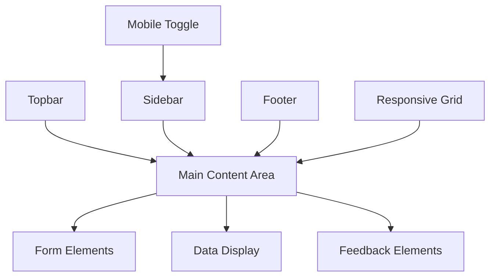

# Admin Panel UI Elements Breakdown

This document provides a comprehensive breakdown of UI elements needed for a simple admin panel template. It includes layout components (topbar, sidebar), mobile responsiveness, and common elements like buttons, tables, and more. Assumes a web-based implementation (e.g., HTML/CSS/JS or a framework like React/Vue), but concepts are framework-agnostic.

## 1. Layout Components
These form the structural foundation of the admin panel, ensuring a consistent and responsive layout.

- **Topbar/Header**: A horizontal bar at the top for branding, user info, notifications, and quick actions (e.g., search, profile menu). Make it sticky for mobile and include a hamburger menu toggle for sidebar on smaller screens.
- **Sidebar/Navigation Menu**: A vertical menu for primary navigation (e.g., links to dashboard, users, settings). Use collapsible design for mobile responsiveness; icons with labels that stack vertically.
- **Main Content Area**: The central container for page content, using a flexible grid or flexbox layout that adapts to screen size (e.g., full-width on mobile, with sidebar margin on desktop).
- **Footer**: Optional bottom section for copyright, links, or secondary info; keep minimal and responsive.
- **Grid System**: Responsive grid (e.g., CSS Grid or Bootstrap-like) to organize content into columns/rows that stack on mobile.

## 2. Form Elements
Essential for user input and data entry in admin tasks like creating/editing records.

- **Input Box/Text Field**: Basic text input for names, emails, etc. Include variants like password fields with show/hide toggle; ensure mobile-friendly keyboard types (e.g., email, number).
- **Select/Dropdown**: For choosing options (e.g., status, category). Use searchable or multi-select variants; make touch-friendly on mobile with larger tap targets.
- **Checkbox/Radio Buttons**: For boolean or single-choice selections (e.g., enable/disable features). Group them in responsive containers.
- **Textarea**: Multi-line text input for descriptions or notes; auto-resize for better mobile UX.
- **File Upload**: Drag-and-drop or button-based for images/documents; show previews and progress indicators.
- **Date/Time Picker**: Calendar or time selector for scheduling; ensure mobile-optimized with native pickers where possible.
- **Button**: Primary, secondary, and danger variants for actions (e.g., Save, Cancel, Delete). Include loading states and disabled styles; size appropriately for mobile (e.g., larger touch targets).

## 3. Data Display
For presenting information, lists, and analytics in a readable, responsive format.

- **Table/Data Table**: Sortable, filterable tables for lists (e.g., user data). Include pagination and responsive design (e.g., horizontal scroll or card view on mobile).
- **Cards**: Container for summarized info (e.g., dashboard stats); stack vertically on mobile.
- **Charts/Graphs**: Simple visualizations (e.g., bar, pie charts) using libraries like Chart.js; ensure responsive scaling.
- **Lists**: Ordered/unordered lists for navigation or data; use collapsible accordions for mobile.
- **Pagination**: Controls for navigating large datasets (e.g., Previous/Next buttons, page numbers); hide/show based on screen size.

## 4. Navigation
Beyond the sidebar, these enhance user flow and accessibility.

- **Breadcrumbs**: Trail of links showing current page location (e.g., Home > Users > Edit); hide on mobile for space.
- **Tabs**: For switching between views (e.g., Overview, Details); make swipeable on mobile.
- **Search Bar**: Global or page-specific search with autocomplete; position in topbar and optimize for mobile keyboards.
- **Menu/Dropdown Menus**: For user actions or sub-navigation; ensure accessible and touch-friendly.

## 5. Feedback and Interaction
To communicate status, errors, and user actions effectively.

- **Toast/Notification**: Pop-up messages for success/error alerts (e.g., "User saved successfully"); position fixed and auto-dismiss; stack on mobile.
- **Modal/Dialog**: Overlay windows for confirmations or forms (e.g., delete confirmation); ensure mobile-friendly with full-screen on small devices.
- **Loading Spinner/Progress Bar**: Indicators for async operations (e.g., saving data); keep subtle and responsive.
- **Alerts/Banners**: Inline messages for warnings or info; color-coded (e.g., red for errors).
- **Tooltips**: Hover/focus hints for icons or buttons; adapt to touch on mobile (e.g., tap to show).

## 6. Miscellaneous
Additional elements for polish, accessibility, and functionality.

- **Icons**: Consistent icon set (e.g., Font Awesome) for buttons, menus, and status indicators; ensure scalable and accessible.
- **Avatar/Profile Image**: User images in topbar or lists; fallback to initials.
- **Badges/Tags**: Small labels for status (e.g., "Active", "Pending"); use in tables or cards.
- **Empty States**: Placeholder content when no data (e.g., "No users found"); include call-to-action buttons.
- **Theme Toggle**: Light/dark mode switch for user preference; persist across sessions.
- **Accessibility Features**: ARIA labels, keyboard navigation, high contrast modes; ensure WCAG compliance.

## Visual Structure Diagram
To clarify the overall layout, here's a Mermaid diagram showing the admin panel's hierarchy:

This diagram illustrates how the topbar and sidebar frame the content area, with elements adapting to mobile (e.g., sidebar collapses via toggle).

## Additional Considerations
- **Mobile Responsiveness**: Use media queries (e.g., breakpoints at 768px, 1024px) for all elements. Prioritize touch targets (44px minimum), swipe gestures for navigation, and fluid layouts.
- **Styling/Theming**: Apply a consistent design system (e.g., colors, fonts, spacing) using CSS variables or a framework like Tailwind CSS.
- **Functionality**: Elements should integrate with backend APIs for dynamic data; consider state management for interactivity.
- **Best Practices**: Keep the template simple and extensible; test on various devices/browsers.

This breakdown covers the essentials for a functional admin panel. If you need details on a specific element, implementation examples, or focus on a particular framework, provide more details.